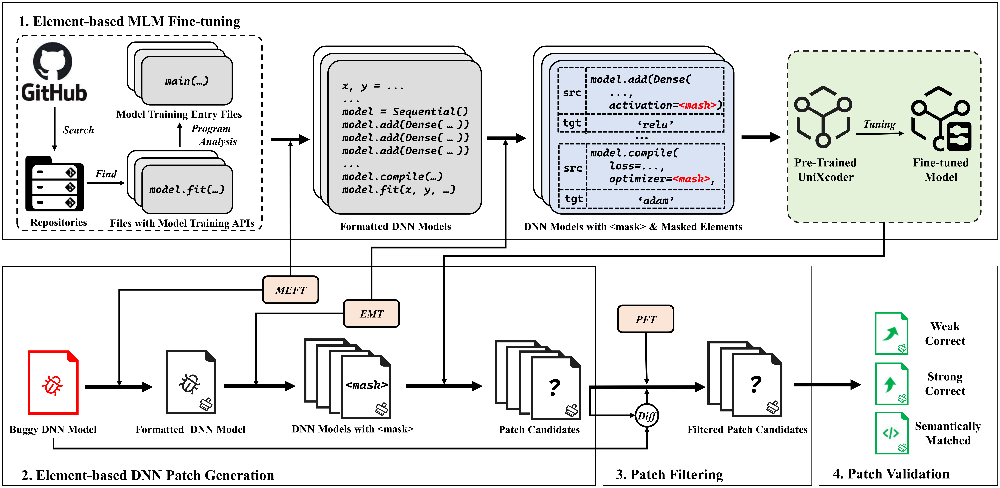

# MLM4DNN (Element-based Automated DNN Repair with Fine-tuned Masked Language Model)

## Overview of MLM4DNN



## Main Components
1. Fine-tuning
2. Patch Generation
3. Patch Filtering
4. Patch Validation

## Preparation
1. Clone repository
    ```shell
    git clone https://github.com/PGZXB/MLM4DNN.git
    ```

2. Benchmark preparation
    * Refer to [benchmark/README.md](./benchmark/README.md) to get our benchmark (i.e., $Benchmark_{APR4DNN}$)

3. Dataset preparation
    * Refer to [dataset/README.md](./dataset/README.md) to get our dataset (i.e., $Dataset_{MLM}$)

4. Model preparation
    * Refer to [models/README.md](./models/README.md) to get our fine-tuned model

5. Main [conda](https://www.anaconda.com/) env preparation (for component 1,2,3)
    * Create: ```conda create --name mlm4dnn_main python=3.11.0```
    * Install libraries for this env
        * pytorch 2.1.0
        * transformers 4.36.2
        * requests 2.31.0
        * tqdm 4.66.1
    * See [mlm4dnn_main_env.yml](./mlm4dnn_main_env.yml) for details

6. PV [conda](https://www.anaconda.com/) env preparation (for component 4)
    * Create: ```conda create --name mlm4dnn_pv python=3.6.13```
    * Install libraries for this env
        * keras 2.3.1
        * tensorflow 2.1.0
        * numpy 1.18.5
        * pandas 1.0.5
        * scikit-learn 0.23.1
        * astunparse 1.6.3
    * See [mlm4dnn_pv_env.yml](./mlm4dnn_pv_env.yml) for details

## Repro on $Benchmark_{APR4DNN}$

```shell
conda activate mlm4dnn_main
python mlm4dnn.py repro --dnn-train-env-name mlm4dnn_pv --output-dir /path/to/output
```

## Re-Finetune Model & Perform MLM4DNN on New Model

1. Model Fine-tuning
    * ```conda activate mlm4dnn_main```
    * ```python mlm4dnn.py train```
    * The log and checkpoints will be saved in models/

2. MLM4DNN Performing
    * Create a config file (refer to [configs/infill_api_config.json](./configs/infill_api_config.json))
        * Change `output_dir` to new model's
    * To `Repro`: `python mlm4dnn.py repro ... --infill-api-config-file /path/to/your_config`
